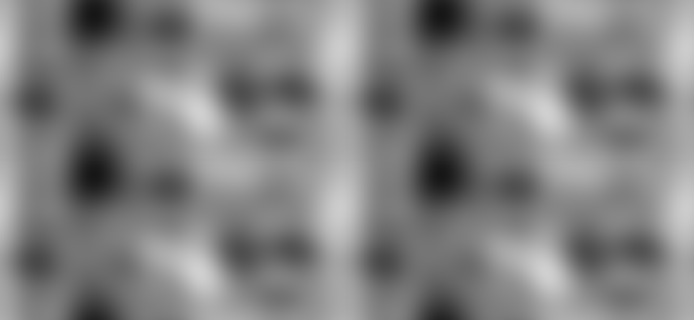
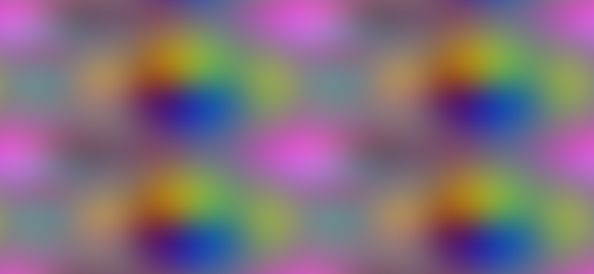

# TileableNoise.js

**TileableNoise.js** is a simple library that helps creat seamless tileable noise for many uses.
The Simplex Noise implementation by **jwagner** is required.

## Introduction

This class uses the idea of taking the output of a noise function, walking in a 2D circle, so the end value is equal to the start value, to allow for tileable noise, both in 1D.\
By utilizing 2 circles in a 4D noise space it was possible to make tileable noise in a 2D enviroment.
I got inspiration from Daniel Shiffman's video: [Coding Challenge #136.1: Polar Perlin Noise Loops](https://www.youtube.com/watch?v=ZI1dmHv3MeM), from the channel: "The Coding Train". After seeing the video I wanted to try out making 2D tileable noise, and here I am.

## Examples

*Image made with the library. Red lines mark the seamless tile*

*Using 3 noise functions as the color channels to get a colorful tileable image*

*Noise generated blob that doesn't has an begin/end at the circumference*

## TODO List

- [x] Make it independent from p5.js
- [x] Add seed property
- [ ] Add an wiki with all the funcionalities
- [ ] Make a Processing version
- [ ] Make a minimal version
- [ ] Optimize it
- [ ] Add 2D animation? (Requires 5D noise)
